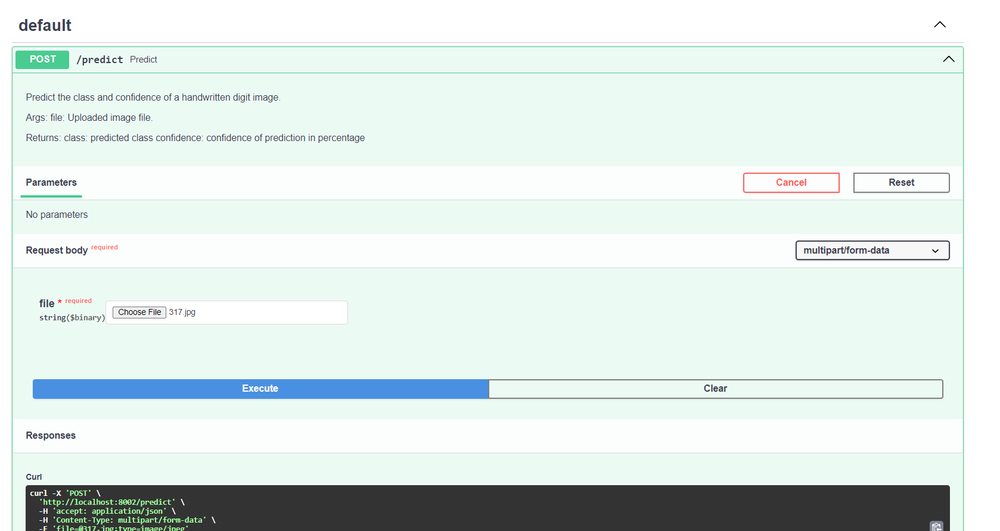

# MNIST classifier

A CNN model for classifying Hand-Written numbers in gray scale images.

## Setup Environment

### Using conda

#### Option 1: Using requirements.txt

```bash
conda create -n mnist python=3.10
conda activate mnist
pip install -r requirements.txt
```

#### Option 2: Using environment.yml

```bash
conda env create -f environment.yml
pip install -r requirements.txt
```
If facing issues with install pytorch, refer to https://pytorch.org/ for installing appropriate version of pytorch based on your system configuration.

## Dataset Preparation

- Step 1: Download dataset from https://web.archive.org/web/20220331130319/https://yann.lecun.com/exdb/mnist/
- Step 2: Unzip the downloaded file to the desired location
- Step 3: Use mnist_to_image.py to convert the dataset to images
  - set `UNPROCESSED_DATA_ROOT_DIR` in `config.py` to the location of the downloaded dataset
  - set `DATA_ROOT_DIR` in `config.py` to the location where you want to save the processed images

## Train a classifier

Change the settings for training and evaluation in `config.py`. The assets folder contains the confusion matrix plot and a plot for model prediction on test dataset.

To train the model, run the following command:
    
```bash
python train.py
```

This will store the model checkpoints in the `checkpoints` directory.

### Evaluate the model on test images

```bash
python eval.py
```

The model achieves an accuracy of 98.96% on the test set.

Per class accuracy achieved is as follows:
```
Class 0 accuracy: 0.996938775510204
Class 1 accuracy: 0.9911894273127754
Class 2 accuracy: 0.9844961240310077
Class 3 accuracy: 0.9861386138613861
Class 4 accuracy: 0.9887983706720977
Class 5 accuracy: 0.9910313901345291
Class 6 accuracy: 0.9906054279749478
Class 7 accuracy: 0.9892996108949417
Class 8 accuracy: 0.9907597535934292
Class 9 accuracy: 0.9871159563924677
```

run `eval.py` to reproduce the results.

## Serving the classifier using FastAPI
```bash
python app.py
```

The API will be available at `http://localhost:8002/docs`

Choose an image file from the test images folder of the extracted dataset and click on the `execute` button to see the prediction.

